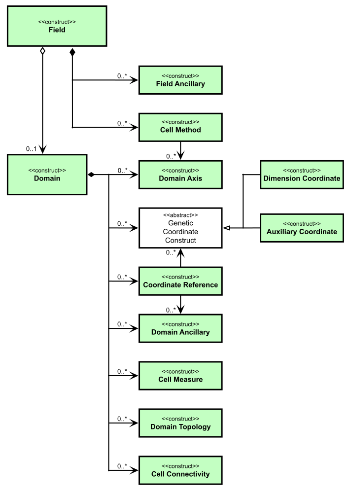

.. currentmodule:: cf
.. default-role:: obj

.. raw:: html

    

.. role:: small

.. _CF-data-model:

**CF data model**
=================

----

Version |release| for version |version| of the CF conventions.

The CF (Climate and Forecast) metadata conventions
(http://cfconventions.org) provide a description of the physical
meaning of data and of their spatial and temporal properties and are
designed to promote the creation, processing, and sharing of climate
and forecasting data using netCDF files and libraries
(https://www.unidata.ucar.edu/software/netcdf).

`The CF data model
<https://cfconventions.org/cf-conventions/cf-conventions.html#appendix-CF-data-model>`_
identifies the fundamental elements ("constructs") of the CF
conventions and shows how they relate to each other, independently of
the netCDF encoding.

The CF data model defines a **field construct** for storing data with
all of its metadata. It is defined as follows:

.. glossary::

  field construct
    corresponds to a CF-netCDF data variable with all of its
    metadata. It consists of

    - descriptive properties that apply to field construct as a whole
      (e.g. the standard name),
    
    - a data array,

    - a **domain construct** that describes the locations of each cell
      of the data array (i.e. the "domain"),
    
    - **metadata constructs** that describe the physical nature of the
      data array, defined by

      .. glossary::
         
        field ancillary constructs
          corresponding to CF-netCDF ancillary variables
      
        cell method constructs
          corresponding to a CF-netCDF cell_methods attribute of data
          variable

  domain construct
    that describes the locations of each cell of the domain. It may
    exist independently of a **field construct** and consists of

    - descriptive properties that apply to domain construct as a whole,
    
    - **metadata constructs** that describe the locations of each cell
      of the domain, defined by 
    
    .. glossary::
         
      domain axis constructs
        corresponding to CF-netCDF dimensions or scalar coordinate
        variables
    
      dimension coordinate constructs
        corresponding to CF-netCDF coordinate variables or numeric
        scalar coordinate variables
    
      auxiliary coordinate constructs
        corresponding to CF-netCDF auxiliary coordinate variables and
        non-numeric scalar coordinate variables
    
      coordinate reference constructs
        corresponding to CF-netCDF grid mapping variables or the
        formula_terms attribute of a coordinate variable
    
      domain ancillary constructs
        corresponding to CF-netCDF variables named by the
        formula_terms attribute of a coordinate variable
    
      cell measure constructs
        corresponding to CF-netCDF cell measure variables

      domain topology constructs
        corresponding to CF-netCDF UGRID mesh topology variables

      cell connectivity constructs
        corresponding to CF-netCDF UGRID connectivity variables

----

|

   *The constructs of the CF data model described using UML. The field construct corresponds to a CF-netCDF data variable. The domain construct provides the linkage between the field construct and the constructs which describe measurement locations and cell properties. It is useful to define an abstract generic coordinate construct that can be used to refer to coordinates when the their type (dimension or auxiliary coordinate construct) is not an issue.*

----
