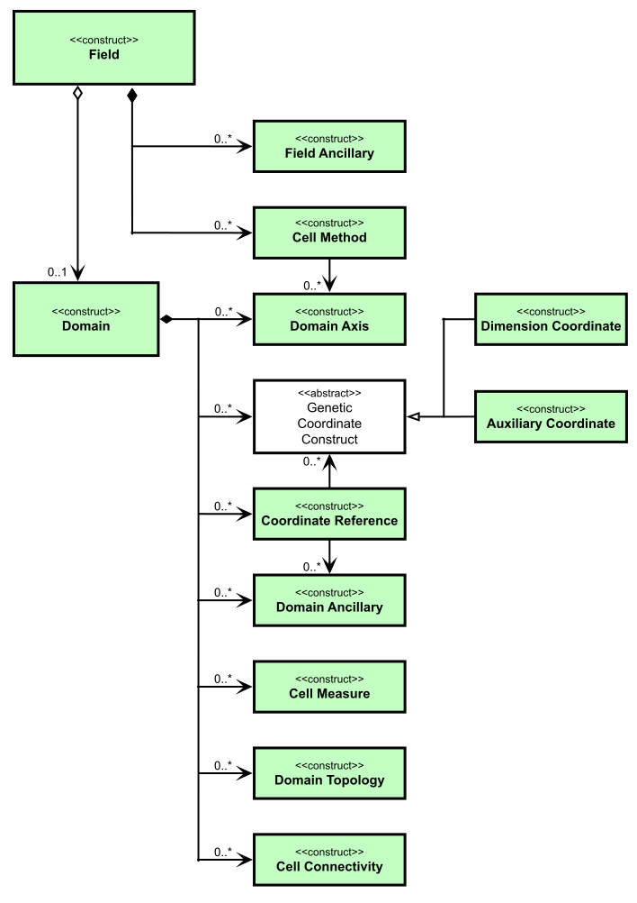

.. currentmodule:: cf
.. default-role:: obj

.. raw:: html

    

.. role:: red

.. raw:: html

    

.. role:: blue

.. raw:: html

    

.. role:: small

**Introduction**
================

----

Version |release| for version |version| of the CF conventions.

The Python `cf` package is an Earth Science data analysis library that
is built on a complete implementation of the :ref:`CF-data-model`.

.. contents::
   :local:
   :backlinks: entry

**Functionality**
-----------------

The `cf` package implements the :ref:`CF-data-model` for its internal
data structures and so is able to process any CF-compliant dataset. It
is not strict about CF-compliance, however, so that partially
conformant datasets may be ingested from existing datasets and written
to new datasets.This is so that datasets that are partially conformant
may nonetheless be modified in memory.

.. code-block:: python
   :caption: *A basic example of reading a field construct from a
             file and inspecting it.*

   >>> import cf
   >>> f = cf.read('file.nc')
   >>> f
   [<CF Field: air_temperature(time(12), latitude(64), longitude(128)) K>]
   >>> print(f[0])
   Field: air_temperature (ncvar%tas)
   ----------------------------------
   Data            : air_temperature(time(12), latitude(64), longitude(128)) K
   Cell methods    : time(12): mean (interval: 1.0 month)
   Dimension coords: time(12) = [1991-11-16 00:00:00, ..., 1991-10-16 12:00:00] noleap
                   : latitude(64) = [-87.8638, ..., 87.8638] degrees_north
                   : longitude(128) = [0.0, ..., 357.1875] degrees_east
                   : height(1) = [2.0] m

The `cf` package uses :ref:`Dask <Performance>` for all of its array
manipulation and can:

* read :term:`field constructs <field construct>` and :term:`domain
  constructs <domain construct>` from netCDF, CDL, PP and UM datasets
  with a choice of netCDF backends,

* read files from OPeNDAP servers and S3 object stores,

* create new field constructs in memory,

* write and append field constructs to netCDF datasets on disk,

* read, write, and manipulate UGRID mesh topologies,

* read, write, and create coordinates defined by geometry cells,

* read netCDF and CDL datasets containing hierarchical groups,

* inspect field constructs,

* test whether two field constructs are the same,

* modify field construct metadata and data,

* create subspaces of field constructs,

* write field constructs to netCDF datasets on disk,

* incorporate, and create, metadata stored in external files,

* read, write, and create data that have been compressed by convention
  (i.e. ragged or gathered arrays, or coordinate arrays compressed by
  subsampling), whilst presenting a view of the data in its
  uncompressed form,

* combine field constructs arithmetically,

* manipulate field construct data by arithmetical and trigonometrical
  operations,

* perform statistical collapses on field constructs,

* perform histogram, percentile and binning operations on field
  constructs,

* regrid structured grid, mesh and DSG field constructs with
  (multi-)linear, nearest neighbour, first- and second-order
  conservative and higher order patch recovery methods, including
  3-d regridding,

* apply convolution filters to field constructs,

* create running means from field constructs,

* apply differential operators to field constructs,

* create derived quantities (such as relative vorticity).

----

**Visualisation**
-----------------

Powerful, flexible, and user-friendly visualisations of field
constructs are available with the `cf-plot` package that is installed
separately to `cf` (see the
`cf-plot documentation
<https://ncas-cms.github.io/cf-plot/build/>`_ for details).

See the `cf-plot gallery
<https://ncas-cms.github.io/cf-plot/build/gallery.html>`_ for the wide range
of plotting possibilities with example code.

.. figure:: images/cfplot_example.png

   *Example output of cf-plot displaying a cf field construct.*

----

**Performance**
---------------

As of version 3.14.0 (released 2023-01-31), cf uses :ref:`Dask
<Performance>` for all of its data manipulations, which provides lazy,
parallelised, and out-of-core computations of array operations.

----

**Command line utilities**
--------------------------

During installation the ``cfa`` command line utility is also
installed, which

* generates text descriptions of field constructs contained in files,
  and

* creates new datasets aggregated from existing files.

----

.. _CF-data-model:

**CF data model**
-----------------

The CF (Climate and Forecast) metadata conventions
(http://cfconventions.org) provide a description of the physical
meaning of data and of their spatial and temporal properties and are
designed to promote the creation, processing, and sharing of climate
and forecasting data using netCDF files and libraries
(https://www.unidata.ucar.edu/software/netcdf).

`The CF data model
<https://cfconventions.org/cf-conventions/cf-conventions.html#appendix-CF-data-model>`_
identifies the fundamental elements ("constructs") of the CF
conventions and shows how they relate to each other, independently of
the netCDF encoding.

The CF data model defines a **field construct** for storing data with
all of its metadata. It is defined in CF-|version| as follows:

.. glossary::

  field construct
    corresponds to a CF-netCDF data variable with all of its
    metadata. It consists of

    - descriptive properties that apply to field construct as a whole
      (e.g. the standard name),
    
    - a data array,

    - a **domain construct** that describes the locations of each cell
      of the data array (i.e. the "domain"),
    
    - **metadata constructs** that describe the physical nature of the
      data array, defined by

      .. glossary::
         
        field ancillary constructs
          corresponding to CF-netCDF ancillary variables
      
        cell method constructs
          corresponding to a CF-netCDF cell_methods attribute of data
          variable

  domain construct
    that describes the locations of each cell of the domain. It may
    exist independently of a **field construct** and consists of

    - descriptive properties that apply to domain construct as a whole,
    
    - **metadata constructs** that describe the locations of each cell
      of the domain, defined by 
    
    .. glossary::
         
      domain axis constructs
        corresponding to CF-netCDF dimensions or scalar coordinate
        variables
    
      dimension coordinate constructs
        corresponding to CF-netCDF coordinate variables or numeric
        scalar coordinate variables
    
      auxiliary coordinate constructs
        corresponding to CF-netCDF auxiliary coordinate variables and
        non-numeric scalar coordinate variables
    
      coordinate reference constructs
        corresponding to CF-netCDF grid mapping variables or the
        formula_terms attribute of a coordinate variable
    
      domain ancillary constructs
        corresponding to CF-netCDF variables named by the
        formula_terms attribute of a coordinate variable
    
      cell measure constructs
        corresponding to CF-netCDF cell measure variables

      domain topology constructs
        corresponding to CF-netCDF UGRID mesh topology variables

      cell connectivity constructs
        corresponding to CF-netCDF UGRID connectivity variables

|

   *The constructs of the CF data model described using UML. The field construct corresponds to a CF-netCDF data variable. The domain construct provides the linkage between the field construct and the constructs which describe measurement locations and cell properties. It is useful to define an abstract generic coordinate construct that can be used to refer to coordinates when the their type (dimension or auxiliary coordinate construct) is not an issue.*

----

**References**
--------------

Eaton, B., Gregory, J., Drach, B., Taylor, K., Hankin, S., Caron, J.,
  Signell, R., et al. NetCDF Climate and Forecast (CF) Metadata
  Conventions. CF Conventions Committee.
  https://cfconventions.org/cf-conventions/cf-conventions.html

Hassell, D., and Bartholomew, S. L. (2020). cfdm: A Python reference
  implementation of the CF data model. Journal of Open Source
  Software, 5(54), 2717, https://doi.org/10.21105/joss.02717

Hassell, D., Gregory, J., Blower, J., Lawrence, B. N., and
  Taylor, K. E. (2017). A data model of the Climate and Forecast
  metadata conventions (CF-1.6) with a software implementation
  (cf-python v2.1), Geosci. Model Dev., 10, 4619-4646,
  https://doi.org/10.5194/gmd-10-4619-2017

Rew, R., and Davis, G. (1990). NetCDF: An Interface for Scientific
  Data Access. IEEE Computer Graphics and Applications, 10(4),
  76–82. https://doi.org/10.1109/38.56302

Rew, R., Hartnett, E., and Caron, J. (2006). NetCDF-4: Software
  Implementing an Enhanced Data Model for the Geosciences. In 22nd
  International Conference on Interactive Information Processing
  Systems for Meteorology, Oceanography, and Hydrology. AMS. Retrieved
  from
  https://www.unidata.ucar.edu/software/netcdf/papers/2006-ams.pdf

