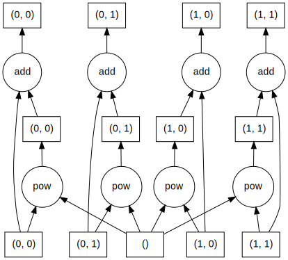

.. currentmodule:: cf
.. default-role:: obj

.. _Performance:

**Performance**
===============

----

Version |release| for version |version| of the CF conventions.

.. contents::
   :local:
   :backlinks: entry

.. _Dask:

**Dask**
--------

A data array in `cf` is stored internally by a `Dask array
<https://docs.dask.org/en/latest/array.html>`_ that provides lazy,
parallelised, and out-of-core computations of array
operations. Computations are automatically optimised to maximise the
re-use of data in memory, and to avoid calculations that do not
contribute for the final result.

The performance of `cf` is largely a function of the performance of
Dask. All of the techniques that Dask supports for `improving
performance <https://docs.dask.org/en/stable/best-practices.html>`_
apply, and performance parameters can be set via Dask's `configuration
settings <https://docs.dask.org/en/stable/configuration.html>`_. The
default value of the important :ref:`chunk size <Chunks>` can also be
set through the `cf` API.

----

.. _Lazy-operations:

**Lazy operations**
-------------------

In general, all `cf` operations are lazy (such as reading from disk,
regridding, collapsing, subspacing, arithmetic, etc.), meaning that an
operation is not actually performed until the result is actually
inspected, for instance by creating a plot of the data, writing the
data to disk, or printing the array values. When multiple operations
are applied one after another, none of the operations are computed
until the result of final one is requested.

When the result of a stack of lazy operations is computed it is not
cached, so if the operations are subsequently re-computed then the
calculations are repeated. However, a construct's `~cf.Field.persist`
method can be used force the result to be retained in memory for fast
future access.

Some notable cases where non-lazy computation occurs are:

* **Regridding**

  When regridding a field construct with either of the
  `cf.Field.regrids` or `cf.Field.regridc` methods, the regridding
  weights are computed non-lazily, which requires calculations based
  in some or all of the coordinate data. These computations can be
  much more costly than the regridding itself. When multiple regrid
  operations have the same weights, performance can be improved be
  calculating the weights once and re-using them:
  
  .. code-block:: python
     :caption: *Regrid a list of fields with the same horizontal
               domain using pre-computed regridding weights.*
		       
     >>> weights = fl[0].regrids(dst, method='conservative', return_operator=True)
     >>> regridded = [f.regrids(weights) for f in fl]
   
* **Aggregation**

  When two or more field or domain constructs are aggregated to form a
  single construct, either by `cf.aggregate` or `cf.read` (the latter
  calls the former by default), the data arrays of some metadata
  constructs (coordinates, cell measures, etc.) must be compared
  non-lazily to ascertain if the aggregation is possible.

..

* **Reading compressed-by-convention datasets from disk**

  When reading from files datasets that have been compressed by
  convention (such as compression by gathering, or some discrete
  sampling geometries), the compression metadata, such as the "list"
  array for compression by gathering, are read from disk non-lazily
  during the `cf.read` operation.

----

.. _Chunks:

**Chunks**
----------

A Dask array is divided into pieces called "chunks" that are the
elements over which Dask computations can be parallelised, and
performance is strongly dependent on the nature of these chunks.

By default, chunks have a size of at most ``128 MiB`` and prefer
square-like shapes. A new default chunk size may be set with the
`cf.chunksize` function. The default chunk size and shape may be
overridden by `cf.read`, as well when creating `cf.Data` instances ab
initio. Any data may be re-chunked after its creation with the
`cf.Data.rechunk` method.

In general, good performance results from following these rules for
chunk sizes and shapes (copied from the `Dask documentation
<https://docs.dask.org/en/stable/array-chunks.html>`_):

* A chunk should be small enough to fit comfortably in memory. There
  will have many chunks in memory at once. Dask will often have as
  many chunks in memory as twice the number of active threads.

* A chunk must be large enough so that computations on that chunk take
  significantly longer than the ``1 ms`` overhead per task that
  :ref:`Dask scheduling <Parallel-computation>` incurs. A task should
  take longer than ``100 ms``.

* Chunk sizes between ``10 MiB`` and ``1 GiB`` are common, depending
  on the availability of RAM and the duration of computations.

* Chunks should align with the computation that you want to do. For
  example, if you plan to frequently slice along a particular
  dimension, then it's more efficient if your chunks are aligned so
  that you have to touch fewer chunks. If you want to add two arrays,
  then its convenient if those arrays have matching chunks patterns.

* Chunks should align with your storage, if applicable.

For more information, see `Choosing good chunk sizes in Dask
<https://blog.dask.org/2021/11/02/choosing-dask-chunk-sizes>`_.

----

.. _Parallel-computation:

**Parallel computation**
------------------------

All operations on Dask arrays are executed in parallel using Dask's
`dynamic task scheduling
<https://docs.dask.org/en/stable/scheduling.html>`_. By default, the
scheduler uses threads on the local machine, but it is easy to use
instead local processes, a cluster of many machines, or a single
thread with no parallelism at all.

Implementing a different scheduler is done via any of the methods
supported by Dask, and all `cf` operations executed after a new
scheduler has been defined will use that scheduler.

.. code-block:: python
   :caption: *Various techniques for choosing different task
             schedulers for parallel computations.*

   >>> import cf
   >>> import dask
   >>> dask.config.set(scheduler='processes')
   >>> # cf computations will now use local processes
   >>> dask.config.set(scheduler='synchronous')
   >>> # cf computations will now be single-threaded
   >>> dask.config.set(scheduler='threads')
   >>> # cf computations will now use local threads (the default)
   >>> from dask.distributed import Client
   >>> client = Client('127.0.0.1:8786')
   >>> # cf computations will now use the defined distributed cluster
 
Operations are stored by Dask in `task graphs
<https://docs.dask.org/en/stable/graphs.html>`_ where each task
(i.e. node) in the graph either defines a chunk of the data, or else
an operation to be performed on one or more chunks. The data created
by an operation are used as inputs to the next operation node in the
graph. The tasks in the graph are passed by the scheduler to the
available pool of processing elements (PEs) which execute the tasks in
parallel until the final result has been computed.

The following example shows the task graph for a simple data
computation over four chunks:

.. code-block:: python
   :caption: *Visualising the task graph for a lazy computation.*

   >>> import cf
   >>> import numpy as np
   >>> d = cf.Data(np.arange(30).reshape(5, 6), chunks=3)
   >>> d.npartitions
   4
   >>> d.chunks
   ((3, 2), (3, 3))
   >>> print(d.array)
   [[ 6  7  8  9 10 11]
    [12 13 14 15 16 17]
    [18 19 20 21 22 23]
    [24 25 26 27 28 29]]
   >>> e = d ** 2 + d
   >>> e.to_dask_array().visualize('dask_task_graph.png')
   >>> print(e.array)
   [[  0   2   6  12  20  30]
    [ 42  56  72  90 110 132]
    [156 182 210 240 272 306]
    [342 380 420 462 506 552]
    [600 650 702 756 812 870]]

The image file ``dask_task_graph.png`` contains a visualisation of the
dask task graph, showing the operations on each chunk. The operations
were only executed when their result was requested with the
``e.array`` command. The boxes represent the data chunks and the
circles represent the operations to be performed on the chunks. The
boxes in the bottom row are the starting data (the four chunks of
``d`` and the scalar ``2``), and the boxes in the top row are the
result of the computation which combine to produce the values in
``e.array``.

   *The dask task graph from dask_task_graph.png*

----
